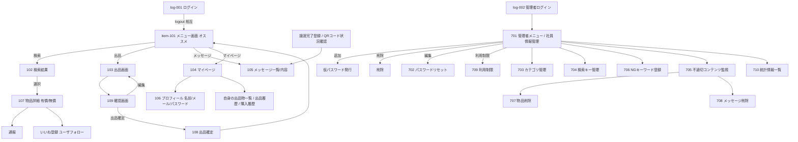

# 画面遷移フロー（HTML全体の流れ）

> ホワイトボード写真（手書きの画面遷移図）を読み取り、HTML全体の流れとして記録したもの。
> 社員側（log-001〜1xx）と管理者側（701〜710）を1枚に通した全体マップ。
> ※手書きの判読が難しい箇所は「（推定）」と付記。実物に合わせて随時修正可。

---

## 1. 画面ID一覧（この遷移図で使われている採番）

> ⚠ ここでの画面IDは **画面遷移図の採番**であり、ユースケースID（UC001 等）とは別系統。
> 例：UC では 101＝「物品を出品」だが、本図では `item-101`＝「メニュー画面」。

### 社員側
| 画面ID | 画面名 | 補足 |
|---|---|---|
| log-001 | ログイン | ログイン画面 |
| log-002 | ログイン（管理者）／ログアウト後 | 管理者ログインの入口（推定） |
| item-101 | メニュー画面（オススメ表示） | 社員のトップ。検索・出品・メッセージ・マイページへの起点 |
| 102 | 物品検索結果画面 | 検索結果一覧・選択 |
| 103 | 出品画面 | 写真アップロード・カテゴリ設定・価格条件・登録期限設定 |
| 104 | マイページ | 自身の出品物一覧・出品履歴・購入履歴 |
| 105 | メッセージ画面 | メッセージ一覧／メッセージ内容 |
| 106 | プロフィール画面 | 名前・メールアドレス・パスワード |
| 107 | 物品詳細画面（有償・無償） | 通報・いいねを登録（ユーザフォロー） |
| 108 | 出品確定 | 出品の確定処理 |
| 109 | 確認画面 | 出品内容の確認（編集／出品確定へ） |

### 管理者側
| 画面ID | 画面名 |
|---|---|
| 701 | 管理者メニュー／社員情報管理（追加・削除・編集・利用制限） |
| 702 | パスワードリセット |
| 703 | カテゴリ管理 |
| 704 | 検索キー管理 |
| 705 | 不適切コンテンツ監視（物品削除・メッセージ削除へ連携） |
| 706 | NGキーワード登録 |
| 707 | 物品削除 |
| 708 | メッセージ削除 |
| 709 | 利用制限（追加時：仮パスワード発行） |
| 710 | 統計情報一覧 |

---

## 2. 社員側の遷移

```
log-001 ログイン
   │ （logout で相互遷移）
   ▼
item-101 メニュー画面（オススメ）
   ├─[検索]──────▶ 102 検索結果 ──[選択]──▶ 107 物品詳細（有償/無償）
   │                                              ├─ 通報
   │                                              └─ いいねを登録（ユーザフォロー）
   │
   ├─[出品]──────▶ 103 出品画面
   │                  （写真アップロード／カテゴリ設定／価格条件／登録期限設定）
   │                      │
   │                      ▼
   │                  109 確認画面 ──[編集]──▶（103へ戻る）
   │                      │
   │                      └─[出品確定]──▶ 108 出品確定 ──▶ item-101 へ戻る
   │
   ├─[メッセージ]─▶ 105 メッセージ一覧 ──▶ メッセージ内容
   │
   └─[マイページ]─▶ 104 マイページ ──▶ 106 プロフィール（名前/メール/パスワード）
                        ├─ 自身の出品物一覧
                        ├─ 出品履歴
                        └─ 購入履歴

［取引系］譲渡完了登録 ／ 譲渡状況QRコード読み込み ──▶ 105 メッセージ内容（連携）
```

## 3. 管理者側の遷移

```
log-002 ──▶ 701 管理者メニュー／社員情報管理
              ├─ 社員情報管理
              │     ├─[追加]──▶ 仮パスワード発行
              │     ├─[削除]
              │     ├─[編集]──▶ 702 パスワードリセット
              │     └─[利用制限]──▶ 709 利用制限
              ├─▶ 703 カテゴリ管理
              ├─▶ 704 検索キー管理
              ├─▶ 706 NGキーワード登録
              ├─▶ 705 不適切コンテンツ監視 ──▶ 707 物品削除 ／ 708 メッセージ削除
              ├─▶ 707 物品削除
              ├─▶ 708 メッセージ削除
              └─▶ 710 統計情報一覧
```

---

## 4. 全体遷移図（Mermaid）



---

## 5. メモ・既存ドキュメントとの関係

- **画面ID体系が2系統**：本図の社員側は `log-001 / item-101 / 102…109` という独自採番。
  これまでに作成した画面レイアウト設計書（`docs/design/画面レイアウト設計書/`）の管理者側
  701〜710 とは整合。**社員側の画面IDは本図が初出**なので、設計を進める際の基準にできる。
- **新規に読み取れた要素**：
  - 物品詳細(107)の「いいねを登録（ユーザフォロー）」… 要件書16機能には無い**追加提案機能**の可能性。
  - メニュー(item-101)が「オススメ」表示を持つ。
  - マイページ(104)に「購入履歴」「出品履歴」。
- **判読が曖昧な箇所**（実物で要確認）：
  - `log-002` がログアウト後遷移か管理者ログインかの解釈。
  - 105 のメッセージ一覧／内容の画面分割の有無。
  - 707/708 が 705 経由のみか、701 から直接遷移も持つか。
- 管理者側 701〜710 の各画面レイアウトは別途作成済み（`docs/design/画面レイアウト設計書/`）。
  社員側（log-001〜109）のレイアウト設計書はまだ未作成。
